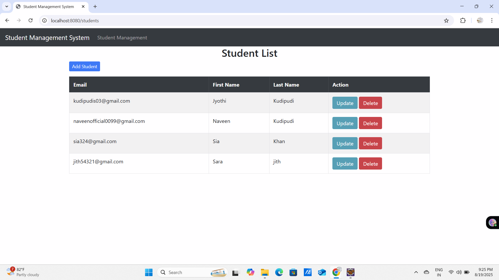
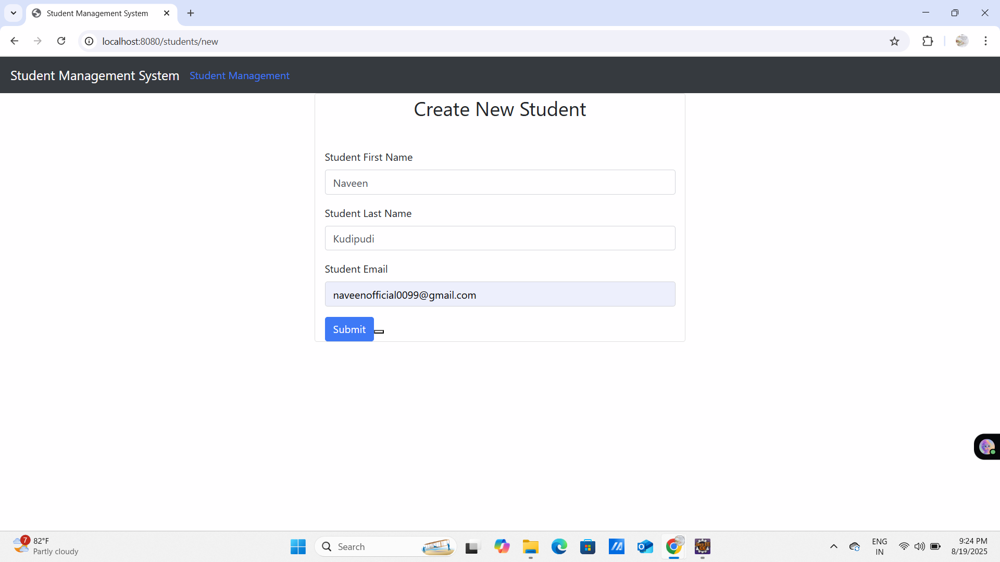

## 🎓 Student Management System (Spring Boot + MySQL)

A full-stack **Spring Boot + Thymeleaf** web application for managing student records.  
This project was built in **Eclipse IDE** with Maven and integrated with **MySQL database**.  
It demonstrates clean project structure, CRUD operations, and industry-standard practices.  

---

## ✨ Project Overview
The **Student Management System** allows administrators to:
- ➕ Add new students  
- 📋 View the list of students  
- ✏️ Update existing student details  
- ❌ Delete students  

It is designed with **Spring MVC** architecture and uses **Spring Data JPA** for database operations.  
The front-end pages are developed with **Thymeleaf templates**.  

---

## 🛠 Tech Stack
- **Language:** Java (Spring Boot 3.x, JDK 17 or higher)  
- **Frameworks:** Spring Boot, Spring MVC, Spring Data JPA  
- **Frontend:** Thymeleaf, HTML, Bootstrap  
- **Database:** MySQL  
- **Build Tool:** Maven  
- **IDE:** Eclipse  
- **Version Control:** Git & GitHub  

---

## 📂 Project Structure (Eclipse + Maven)

```

StudentManagementSystem/
│── .settings/                  # Eclipse IDE settings
│── target/                     # Build output (compiled classes, resources)
│── src/
│   ├── main/
│   │   ├── java/com/StudentsManagementSystem/
│   │   │   ├── StudentsManagementSystemApplication.java   # Main entry point
│   │   │   ├── controller/                                # Controllers (HomeController.java)
│   │   │   ├── entity/                                    # Entity classes (Student.java)
│   │   │   ├── repository/                                # Repository interfaces (Studentrepository.java)
│   │   │   ├── services/                                  # Service interfaces
│   │   │   ├── serviceImpl/                               # Service implementations
│   │   └── resources/
│   │       ├── templates/                                 # Thymeleaf pages (home.html, students.html, etc.)
│   │       └── application.properties                     # DB configuration
│   └── test/                                              # Unit tests
│── pom.xml                        # Maven dependencies
│── mvnw, mvnw\.cmd                 # Maven wrapper scripts
│── .gitignore, .gitattributes     # Git configuration
│── README.md                      # Project documentation

````

---


## 📦 Maven Dependencies (`pom.xml`)

Key dependencies used:

```xml
<dependencies>
    <!-- Spring Boot Starter Web -->
    <dependency>
        <groupId>org.springframework.boot</groupId>
        <artifactId>spring-boot-starter-web</artifactId>
    </dependency>

    <!-- Spring Data JPA -->
    <dependency>
        <groupId>org.springframework.boot</groupId>
        <artifactId>spring-boot-starter-data-jpa</artifactId>
    </dependency>

    <!-- Thymeleaf -->
    <dependency>
        <groupId>org.springframework.boot</groupId>
        <artifactId>spring-boot-starter-thymeleaf</artifactId>
    </dependency>

    <!-- MySQL Driver -->
    <dependency>
        <groupId>com.mysql</groupId>
        <artifactId>mysql-connector-j</artifactId>
        <scope>runtime</scope>
    </dependency>

    <!-- DevTools (for hot reload) -->
    <dependency>
        <groupId>org.springframework.boot</groupId>
        <artifactId>spring-boot-devtools</artifactId>
        <scope>runtime</scope>
    </dependency>

    <!-- Testing -->
    <dependency>
        <groupId>org.springframework.boot</groupId>
        <artifactId>spring-boot-starter-test</artifactId>
        <scope>test</scope>
    </dependency>
</dependencies>
```

---
 **Clone the repository**

   ```bash
   git clone https://github.com/JYOTHIkudipudi/StudentManagementSystem.git
   cd StudentManagementSystem
   ```
 **Open in Eclipse**

   * File → Import → Existing Maven Project → Select the folder.


## ⚙️ Configure MySQL

###  Update `application.properties`

In `src/main/resources/application.properties`:

```properties
spring.application.name=StudentsManagementSystem

spring.datasource.url=jdbc:mysql://localhost:3306/Students
spring.datasource.username=root
spring.datasource.password=yourpassword
spring.datasource.driver-class-name=com.mysql.cj.jdbc.Driver

spring.jpa.properties.hibernate.dialect=org.hibernate.dialect.MySQL8Dialect
spring.jpa.hibernate.ddl-auto=update
spring.jpa.show-sql=true
````

---

###  Setup Database in MySQL

Open the MySQL command line:

```sql
mysql -u root -p
```

Create the database and table:

```sql
CREATE DATABASE Students;
USE Students;

CREATE TABLE student (
    id INT AUTO_INCREMENT PRIMARY KEY,
    first_name VARCHAR(50) NOT NULL,
    last_name VARCHAR(50) NOT NULL,
    email VARCHAR(100) UNIQUE NOT NULL
);
```

Insert sample records:

```sql
INSERT INTO student (first_name, last_name, email)
VALUES
('Jyothi', 'Kudipudi', 'jyothi@example.com'),
('Sita', 'Reddy', 'sita.reddy@example.com'),
('Ravi', 'Kumar', 'ravi.kumar@example.com');
```

Verify:

```sql
SELECT * FROM student;
```

---

###  Run the Project

* **From Eclipse:**
  Right-click `StudentsManagementSystemApplication.java` → **Run As → Java Application**

* **From Terminal:**

  ```bash
  mvn spring-boot:run
  ```

---

###  Access in Browser

```bash
http://localhost:8080/students
```

```


## 📸 Screenshots


### 🏠 Home Page


### ➕ Add Student


### 📖 View Students


### ✏️ Update Student


### ❌ Delete Student


---

## 👩‍💻 Author

**Jyothi Kudipudi**


---

